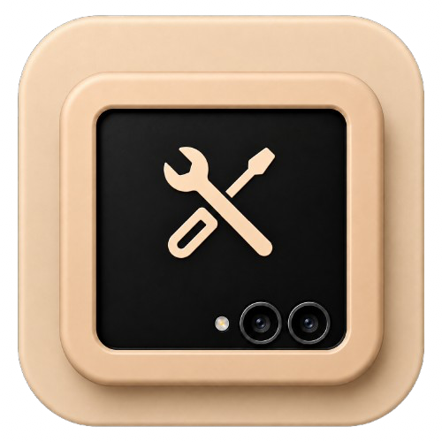

# miniTools

Your folded phone, with the things it should have come with.

miniTools puts three of them on the cover display of a Samsung Galaxy Z Flip:
the task switcher, a launcher for every app, and auto-rotate. All three exist on
the phone already. None of them are offered to the cover screen.

Built for the Galaxy Z Flip 7 FlexWindow.

## What it does

- **Recents** — One UI's own task switcher, on the cover screen, at the panel's
  own density. Nothing is drawn or imitated; the real one is asked to appear
  somewhere it never gets asked.
- **Launcher** — every app on the phone, as a card drawn *over* whatever you were
  doing rather than instead of it. Sort A–Z, Z–A, newest or most used; hold an
  app to favourite or hide it.
- **Rotate** — auto-rotate on a panel Samsung pins to portrait.

Everything is reached from the flash. One tap, two taps and a hold are yours to
assign, plus a swipe up from the bottom-left corner. Nothing is drawn over either
spot: they are places on the panel, not buttons.

The only permission it asks for is the accessibility service, which is what gives
an ordinary app a window that outlives its own activity and sits over the cover
screen. It reads no window content.

## Getting it on the cover screen

Settings → Cover screen → Widgets, and add miniTools like any other cover screen
widget. Good Lock is not involved and is not needed.

Then turn the accessibility service on, and fold the phone.

## How Recents works

If you came here looking for how to put One UI's task switcher on a Flip's cover
screen, this is the part you want.

The switcher is an ordinary activity and it can be started by an ordinary app:

```
com.sec.android.app.launcher/com.android.quickstep.RecentsActivity
```

Start it with `ActivityOptions.setLaunchDisplayId(id)` for the cover display —
found at runtime rather than hard-coded, though it is display 1 on every unit
looked at, 948 × 1048 at 420dpi. It renders correctly at that native density; a
density override buys nothing and costs a privileged permission.

Use `NEW_TASK | CLEAR_TASK | TASK_ON_HOME`. **`CLEAR_TASK` is the important one.**
Without it an existing switcher is only resumed, and it redraws the task list it
built when it was last created — so an app you used a moment ago is missing from
what you see, even though the system's own list has already moved on. Samsung's
gesture never hits this because it enters through quickstep, which reloads the
model on the way in. An explicit start does not.

### The bug you will hit if you also rotate

Rotating the cover panel breaks the switcher's layout, and it stays broken. From
the launcher's own log:

```
RecentInsetsManagerImpl: standardInsetsType: 131, isValidWindowInsets: false
RecentInsetsManagerImpl: Use savedInsets: InsetsData(standardInsets=
    Insets{left=0, top=0, right=220, bottom=0}
```

`right=220` is the camera cutout **as it sits in landscape**. The launcher keeps
saved insets and falls back to them whenever it cannot read live ones — and on
the cover panel it never can, so the saved value is the only value it ever uses.
Rotate once and a sideways value is written into it; every switcher afterwards is
laid out against a landscape panel, with narrow cards and "Close all" under the
camera island.

It survives a launcher restart, which is what makes it look unfixable. It does
not survive a reboot, because the correct value is computed at start-up:

```
isValidWindowInsets: false
updateInsetsData, rotation: 0, isPort: true, insets: {top=0, right=0, bottom=220}
```

So the right answer *is* derivable from the cutout at runtime. It is simply only
derived while the launcher is starting. A force-stop re-runs it and repairs the
switcher exactly; nothing an ordinary app can reach reproduces it. miniTools
offers both: a one-tap repair that starts the switcher once on the inner display
(which writes upright insets over the sideways ones — right shape, sitting a
little low), and a row that opens the page where the force-stop button lives.

Full workings, including what does *not* work and why, in
[`docs/MEASUREMENTS.md`](docs/MEASUREMENTS.md).

## How Rotate works

Samsung will not rotate the cover panel and will not be argued into it.
`wm user-rotation -d 1 lock 1` is accepted and ignored, and so is forcing the
display to disregard app orientation requests.

The way through is to ask rather than tell. A display rotates to satisfy the
topmost window that expresses an orientation, and the cover screen never turns
because the thing on it asks for `SCREEN_ORIENTATION_NOSENSOR`. So miniTools adds
a window of its own — zero by zero, invisible, untouchable — whose only
meaningful property is `screenOrientation = SCREEN_ORIENTATION_SENSOR`.
Everything behind it then turns with the phone.

As an accessibility overlay this costs no permission at all. Inspired by CoverSpin.

## The flash is a button

The camera island is a cutout in the *display*, not in the digitiser: the panel
keeps reporting touches under it even though nothing can be drawn there. Twenty-
seven deliberate taps on the flash landed inside x 444–501, y 916–980, so the
flash is a button that costs no screen at all.

## Building

Everything is built by GitHub Actions. Push to `main` and take the artifact from
the run, or start the workflow by hand.

```
gh run download <run-id> -R RimorCosmicam/miniTools -n minitools-debug-apk
```

The workflow runs the unit tests first, so a green run is one where the gesture
zones still contain every tap they were measured from.

## Open source

MIT. Do what you like with it (but let me know, I love cool stuff).
